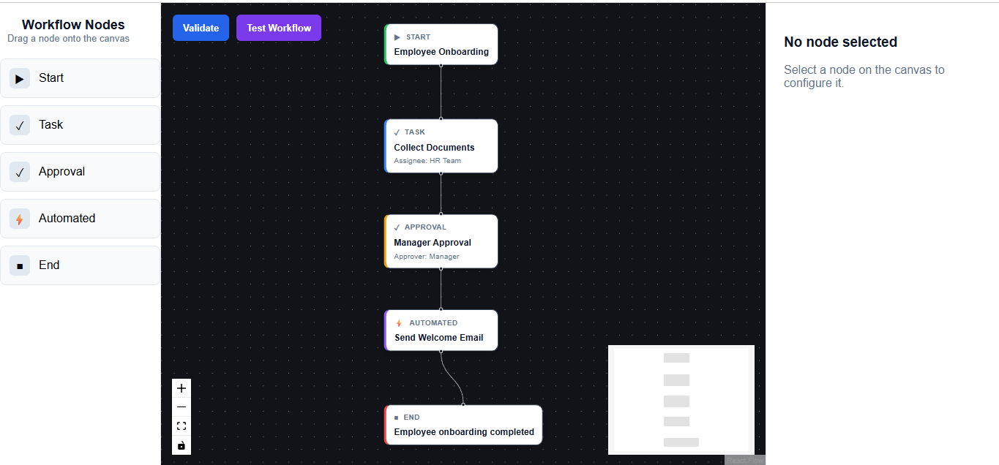
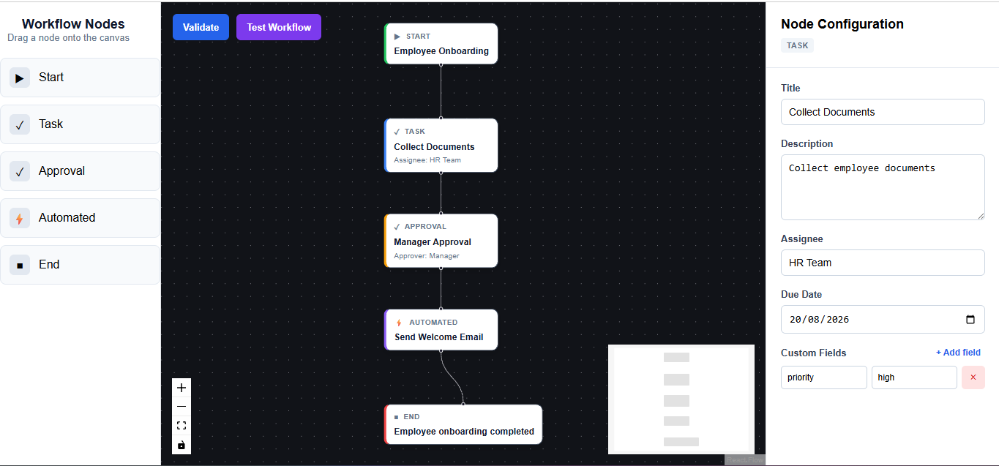
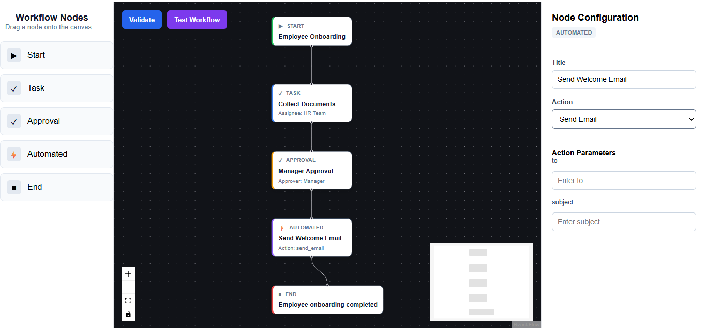
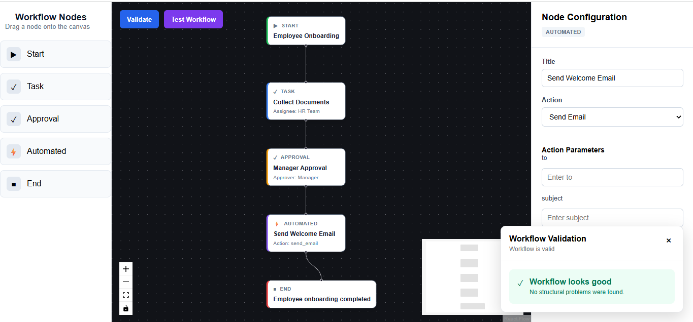
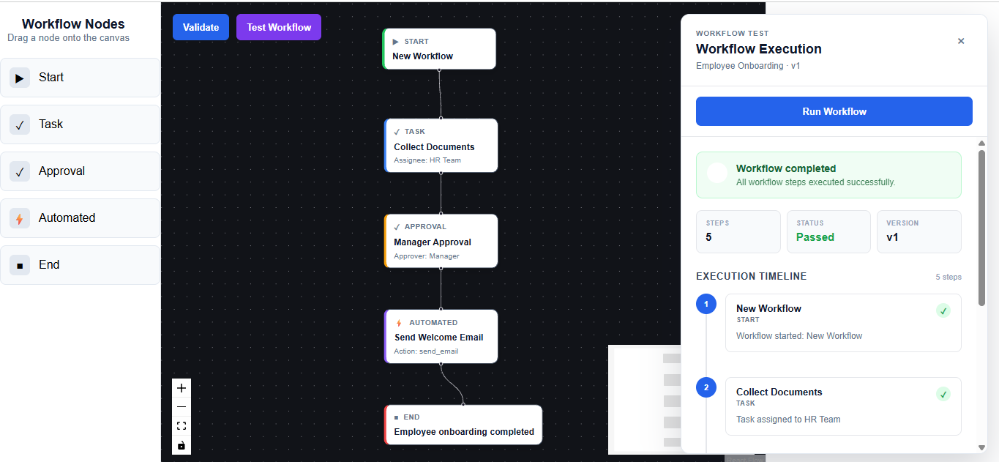

# HR Workflow Designer

A functional prototype of an **HR Workflow Designer** built with React, TypeScript, React Flow, and a lightweight mock API.

The application allows an HR administrator to visually design workflows such as employee onboarding, configure different workflow nodes, validate the workflow structure, and simulate the workflow execution in a sandbox panel.

---

## 📌 Project Overview

This project was developed as a prototype for the **Tredence Analytics – Full Stack Engineering Intern Case Study**.

The main goal was to demonstrate:

- React and React Flow proficiency
- Modular front-end architecture
- Type-safe workflow state management
- Configurable node forms
- Dynamic form generation
- Mock API integration
- Workflow validation
- Workflow simulation/testing

Example workflow:

```text
Start
  ↓
Task
  ↓
Approval
  ↓
Automated Step
  ↓
End
```

---

# 🚀 Features

## Workflow Canvas

The application provides a visual workflow editor using React Flow.

Supported node types:

- **Start Node** – workflow entry point
- **Task Node** – human task
- **Approval Node** – approval step
- **Automated Node** – system-triggered action
- **End Node** – workflow completion

Supported canvas operations:

- Drag nodes from the sidebar
- Drop nodes onto the canvas
- Move nodes
- Connect nodes with edges
- Select nodes
- Edit node configuration
- Delete nodes
- Delete edges
- Zoom and pan the workflow canvas

---

# 🧩 Node Configuration

Each node has its own configuration form.

### Start Node

- Start title
- Metadata key-value pairs

### Task Node

- Title
- Description
- Assignee
- Due date
- Custom fields

### Approval Node

- Title
- Approver role
- Auto-approve threshold

### Automated Node

- Title
- Automation action
- Dynamic action parameters

The Automated Node uses the mock automation API to determine which parameters should be displayed.

For example:

```text
Send Email

to       → employee@example.com
subject  → Welcome to the company
```

Changing the selected automation can dynamically change the available parameter fields.

### End Node

- End message
- Summary flag

---

# 🏗️ Architecture

The application separates workflow state, UI components, node configuration, validation, and API communication.

```text
                         ┌──────────────────────┐
                         │    Workflow Editor   │
                         └──────────┬───────────┘
                                    │
              ┌─────────────────────┼─────────────────────┐
              │                     │                     │
              ▼                     ▼                     ▼
      ┌───────────────┐     ┌───────────────┐     ┌───────────────┐
      │ Workflow      │     │ Node Config   │     │ Validation    │
      │ Canvas        │     │ Panel         │     │ Layer         │
      └───────┬───────┘     └───────────────┘     └───────────────┘
              │
              ▼
      ┌───────────────┐
      │ useWorkflow   │
      │ Custom Hook   │
      └───────┬───────┘
              │
              ▼
      ┌───────────────┐
      │ Workflow State│
      │ Nodes + Edges  │
      └───────┬───────┘
              │
              ▼
      ┌───────────────┐
      │ API Layer     │
      ├───────────────┤
      │ Automations   │
      │ Simulation    │
      └───────┬───────┘
              │
              ▼
      ┌───────────────┐
      │ Mock API      │
      └───────────────┘
```

## Main architectural responsibilities

### `useWorkflow`

The custom hook manages workflow graph state and operations such as:

- Adding nodes
- Updating node data
- Selecting nodes
- Connecting nodes
- Updating edges
- Deleting nodes/edges

This keeps React Flow state management separate from presentation components.

### Workflow Components

The workflow editor is decomposed into smaller components:

- `WorkflowEditor`
- `WorkflowCanvas`
- `WorkflowSidebar`
- `WorkflowTestPanel`
- `ValidationPanel`

### Node Forms

Each node type has its own configuration form.

This makes the form system easier to extend when new node types are introduced.

### API Layer

API communication is kept outside UI components.

The application uses dedicated API functions for:

```text
GET /automations
POST /simulate
```

This allows the UI to remain independent of the mock API implementation.

### Validation Layer

Workflow validation is implemented separately from the canvas.

This allows graph rules to be changed or extended without modifying the React Flow components.

---

# 📁 Folder Structure

The project follows a modular structure similar to:

```text
src/
│
├── api/
│   ├── simulationApi.ts
│   └── types/
│
├── components/
│   ├── NodeConfigPanel.tsx
│   ├── KeyvalueEditor.tsx
│   └── node-forms/
│       ├── StartNodeForm.tsx
│       ├── TaskNodeForm.tsx
│       ├── ApprovalNodeForm.tsx
│       ├── AutomatedNodeForm.tsx
│       └── EndNodeForm.tsx
│
├── hooks/
│   └── useWorkflow.ts
│
├── nodes/
│   ├── StartNode.tsx
│   ├── TaskNode.tsx
│   ├── ApprovalNode.tsx
│   ├── AutomatedNode.tsx
│   └── EndNode.tsx
│
├── validation/
│   ├── workflowValidator.ts
│   └── validation.types.ts
│
├── types/
│   └── workflow.types.ts
│
└── workflow/
    ├── WorkflowEditor.tsx
    ├── WorkflowCanvas.tsx
    ├── WorkflowSidebar.tsx
    ├── WorkflowTestPanel.tsx
    └── workflow.css
```

# 🔌 Mock API

A lightweight mock API is used instead of a production backend.

## Get available automations

```http
GET /automations
```

Example response:

```json
[
  {
    "id": "send_email",
    "label": "Send Email",
    "params": ["to", "subject"]
  },
  {
    "id": "generate_doc",
    "label": "Generate Document",
    "params": ["template", "recipient"]
  }
]
```

The Automated Node uses this data to dynamically generate its action parameter fields.

---

## Simulate workflow

```http
POST /simulate
```

The complete workflow graph is serialized and sent to the simulation API.

The response contains a step-by-step execution result that is displayed in the Workflow Test/Sandbox panel.

Example execution:

```text
1. Employee Onboarding
   START

2. Collect Documents
   TASK

3. Manager Approval
   APPROVAL

4. Send Welcome Email
   AUTOMATED

5. Employee onboarding completed
   END
```

---

# 🧪 Workflow Validation

Before testing a workflow, the application can validate its structure.

Validation is designed to detect invalid workflow structures such as:

- Missing Start node
- Invalid Start/End structure
- Disconnected nodes
- Missing connections
- Invalid edges
- Cycles
- Unreachable workflow nodes

The validation result is displayed separately from the workflow canvas.

This prevents invalid workflow graphs from being blindly simulated.

---

# ▶️ How to Run

## Prerequisites

Make sure the following are installed:

- Node.js
- npm

Check your versions:

```bash
node -v
npm -v
```

---

## 1. Clone the repository

```bash
git clone <YOUR_GITHUB_REPOSITORY_URL>
cd <PROJECT_FOLDER>
```

---

## 2. Install dependencies

```bash
npm install
```

---

## 3. Start the mock API

Start the mock API using the API script/configuration included in the project.

For example, if JSON Server is configured:

```bash
npm run server
```

The mock API should be available on the configured port, for example:

```text
http://localhost:3001
```

---

## 4. Start the React application

```bash
npm run dev
```

The Vite development server will provide a local URL similar to:

```text
http://localhost:5173
```

Open that URL in the browser.

> If the project uses different npm scripts for the mock API, use the scripts defined in `package.json`.

---

# 🎨 Design Decisions

## 1. React Flow for graph editing

React Flow was selected because the core problem is a node-based workflow editor.

It provides:

- Node positioning
- Edge management
- Connection handling
- Selection
- Zooming
- Panning
- Canvas interactions

This allowed the implementation to focus on workflow-specific functionality rather than rebuilding graph interaction logic.

---

## 2. Discriminated TypeScript node types

Workflow nodes are represented using TypeScript types based on their node type.

Conceptually:

```ts
type WorkflowNode =
    | StartNode
    | TaskNode
    | ApprovalNode
    | AutomatedNode
    | EndNode;
```

This provides type safety when working with node-specific configuration.

---

## 3. Separate configuration forms

Instead of creating one large form containing conditions for every node type, each node type has its own form component.

For example:

```text
StartNodeForm
TaskNodeForm
ApprovalNodeForm
AutomatedNodeForm
EndNodeForm
```

This makes the configuration system easier to maintain and extend.

---

## 4. Reusable Key-Value Editor

Metadata and custom fields use a reusable key-value editor.

This avoids duplicating the same UI and state logic for:

- Start metadata
- Task custom fields
- Other future configurable fields

---

## 5. Dynamic Automated Node parameters

Automation parameters are not hardcoded into the Automated Node form.

The selected action definition determines which fields are displayed.

This allows new automation actions to be added through the API without requiring major UI changes.

---

## 6. Separation of API and UI logic

API calls are placed in dedicated API modules rather than directly inside UI components.

This keeps the React components focused on rendering and state interaction and makes replacing the mock API with a real backend easier.

---

## 7. Workflow state in a custom hook

The `useWorkflow` hook centralizes graph state and workflow operations.

This keeps the `WorkflowEditor` component from becoming responsible for all node and edge manipulation logic.

---

# ✅ Completed

The following functionality has been implemented:

- [x] React + Vite application
- [x] React Flow workflow canvas
- [x] Start Node
- [x] Task Node
- [x] Approval Node
- [x] Automated Step Node
- [x] End Node
- [x] Drag and drop nodes
- [x] Connect nodes
- [x] Select nodes
- [x] Delete nodes
- [x] Delete edges
- [x] Node configuration panel
- [x] Controlled node forms
- [x] Start metadata fields
- [x] Task custom fields
- [x] Approval configuration
- [x] Automated action selection
- [x] Dynamic automated action parameters
- [x] End node configuration
- [x] Mock automation API
- [x] Workflow simulation API
- [x] Workflow validation
- [x] Workflow Test/Sandbox panel
- [x] Step-by-step simulation result
- [x] Loading state during simulation
- [x] TypeScript workflow interfaces
- [x] Modular component structure
- [x] React Flow zoom/minimap controls

---

# 📸 Results / Screenshots

> Add screenshots of the completed application below.  
> Recommended screenshots:
>
> 1. Main workflow canvas
> 2. Node configuration panel
> 3. Automated node with dynamic parameters
> 4. Workflow validation result
> 5. Workflow simulation/test result

### 1. Workflow Canvas

<!-- Paste your screenshot here -->



---

### 2. Node Configuration

<!-- Paste your screenshot here -->



---

### 3. Automated Node / Dynamic Parameters

<!-- Paste your screenshot here -->



---

### 4. Workflow Validation

<!-- Paste your screenshot here -->



---

### 5. Workflow Simulation

<!-- Paste your screenshot here -->



---

# ⏳ What I Would Add With More Time

The prototype focuses on the core requirements and intentionally avoids production-level features that were outside the time-boxed scope.

With additional development time, I would add:

### 1. Export / Import Workflow

Allow users to export the workflow graph as JSON and import it later.

```text
Export → workflow.json
Import → Restore workflow
```

### 2. Undo / Redo

Add workflow history so users can safely undo node and edge changes.

### 3. Visual validation errors

Highlight invalid nodes and edges directly on the React Flow canvas instead of only displaying validation messages in a panel.

### 4. Auto-layout

Automatically arrange nodes into a clean workflow layout for larger workflows.

### 5. Node Templates

Provide reusable templates such as:

- Employee Onboarding
- Leave Approval
- Document Verification

### 6. Persistence

Add backend persistence so workflows can be saved and loaded instead of existing only in browser state.

### 7. More advanced simulation

Extend simulation to support:

- Conditional branches
- Parallel execution
- Retry behavior
- Failure states
- Approval outcomes
- Execution timestamps

### 8. Automated testing

Add unit and integration tests for:

- Workflow validation
- Node state updates
- Graph operations
- API handling
- Simulation behavior

---

# ⚖️ Assumptions

- This is a prototype and does not require authentication.
- Backend persistence is intentionally not implemented.
- The API is a mock API intended to demonstrate frontend/API integration.
- Workflow execution is simulated and does not trigger real emails or document generation.
- The application focuses on a single workflow editing session.
- Production-level authorization, auditing, and persistence are outside the scope of this case study.

---

# 🛠️ Tech Stack

- **React**
- **TypeScript**
- **Vite**
- **React Flow**
- **CSS**
- **Mock API / JSON Server**
- **Node.js**
- **npm**

---

# 📌 Conclusion

This prototype demonstrates a modular approach to building a visual HR workflow designer.

The implementation focuses on the core engineering requirements:

**Graph-based workflow editing → typed node configuration → validation → mock API integration → workflow simulation**

The architecture is designed so that additional node types, automation actions, validation rules, and backend functionality can be added without significantly changing the existing workflow editor.
